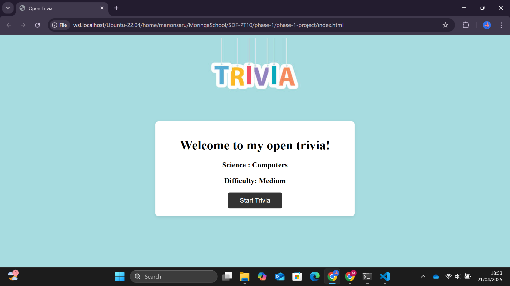
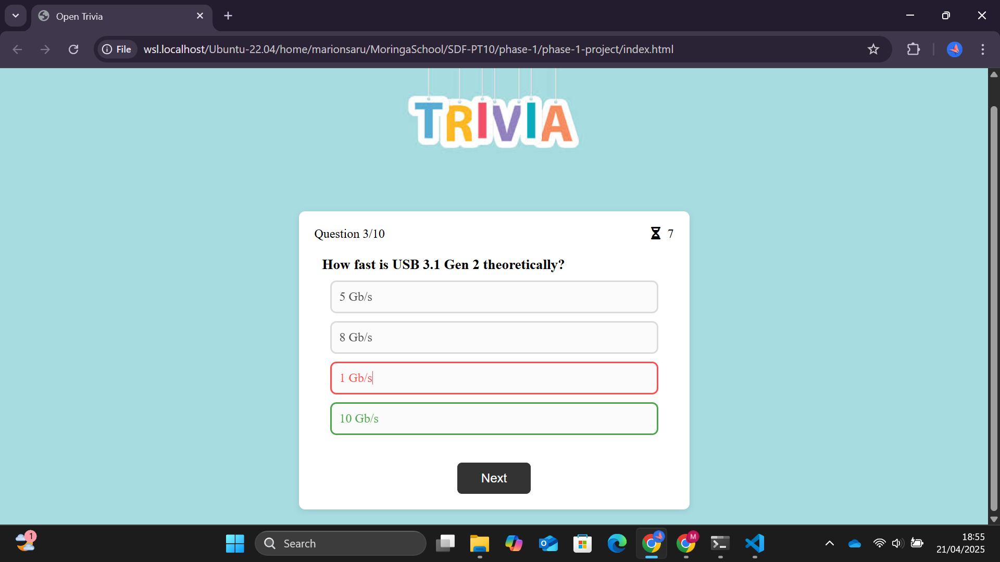
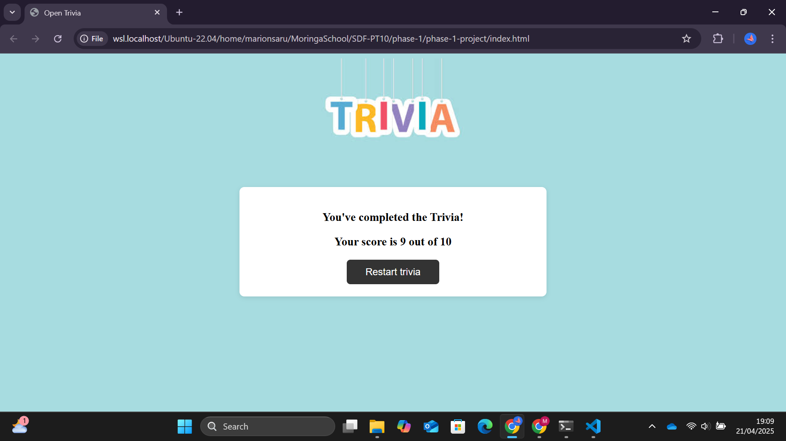

git# 🧠🤔 Open trivia project!

## Description 
This is an interactive quiz game to test one's knowledge on computers with multiple choice questions. The questions are fetched from the public online API [Open trivia DB](https://opentdb.com/api_config.php). The technologies used include ***html***, ***css*** and ***javascript***.

## Live Demo 
[Play trivia!](https://moringa-sdf-pt10.github.io/marion-maghanga-trivia-project/)

## How to use the project 

The user clicks the start trivia button to begin answering the questions.



Users have 10 seconds to answer each question before time runs out and the next question is displayed.

Green indicates the question is correct while red indicates the answer is incorrect.



After submission the user will see their score as well as the option to restart the trivia with a set of new questions.



## Contribution
To contribute to this project follow the steps below:

1.  Fork the repository.

2. Clone the repository to your local.
    ``` shell
    git clone git@github.com:Moringa-SDF-PT10/marion-maghanga-trivia-project.git
    ```

3.  Navigate to the project directory and open the project in your preferred text editor using:  
    ```
    code .
    ```

4. Create your branch.
    ```shell
    git checkout -b <branch-name>
    ```
5. Add the changes, commit them and push your branch name.

6. Create a pull request.

## 👤 Author
[Open Github](https://github.com/Marion-Saru)

### Happy guessing 😊
